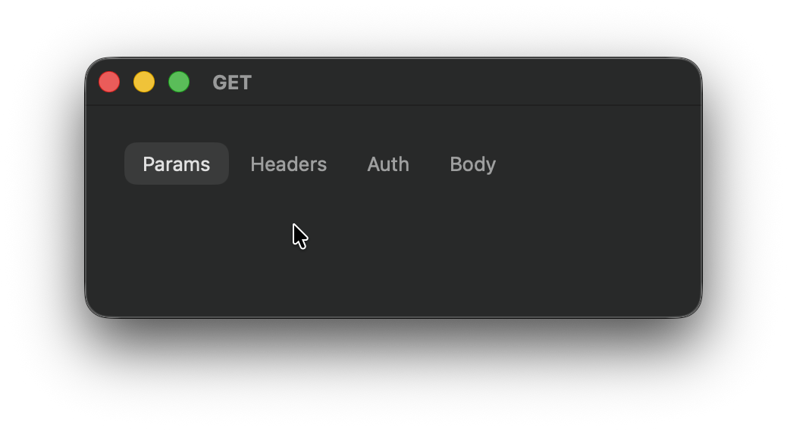
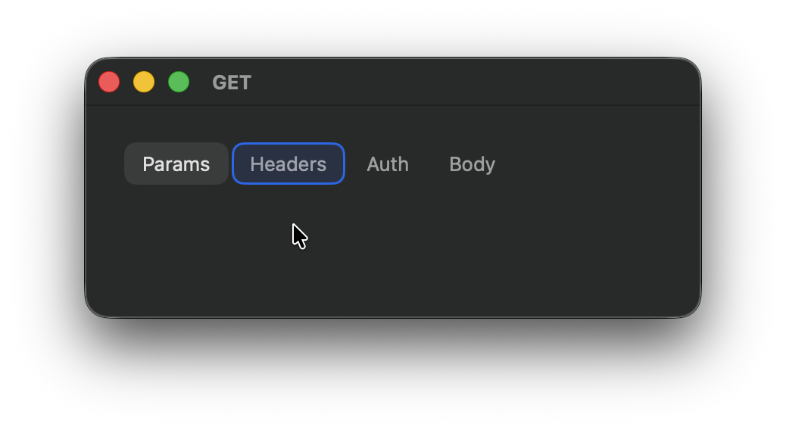

# FocusableTabs

Keyboard-focusable flat tabs for **macOS SwiftUI**.

- Works with Tab / Shift+Tab
- Supports Left/Right arrows
- Space / Return activates the focused tab
- If tabs overflow, they scroll automatically to keep focused/selected tab visible
- Mouse click selects a tab but does not “force” keyboard focus highlight

<p float="left">
  
  
  
</p>

## Installation (Swift Package Manager)

Add package in Xcode:

File → Add Packages Dependencies… → https://github.com/Eugene-Kugut/FocusableTabs.git

## Usage

```swift
import SwiftUI
import FocusableTabs

enum DemoTab: String, CaseIterable, Hashable {
    case params, headers, auth, body
}

struct DemoView: View {
    @State private var selection: DemoTab = .params

    var body: some View {
        FocusableTabs(
            items: DemoTab.allCases.map { tab in
                .init(tab) {
                    Text(tab.rawValue)
                        .font(.body)
                        .foregroundStyle(selection == tab ? .primary : .secondary)
                }
            },
            selection: $selection
        )
    }
}
```

## Customization

```swift
FocusableTabs(
    items: items,
    selection: $selection,
    selectedBackground: Color.primary.opacity(0.12),
    focusedBackground: Color.accentColor.opacity(0.15),
    focusedOverlay: Color.accentColor,
    hoveredBackground: Color.primary.opacity(0.06),
    spacing: 4,
    cornerRadius: 10,
    layout: FocusableTabsLayout = .scroll
)
```

## Layout

- **`scroll`**  
  Displays tabs in a single horizontal row.  
  When the content exceeds the available width, horizontal scrolling is enabled.

- **`wrap(alignment: .leading)`**  
  Displays tabs across multiple rows with automatic line wrapping.  
  Tabs flow to the next line when they no longer fit the available width.  
  Rows are aligned according to the provided alignment (`leading`, `center`, or `trailing`).
